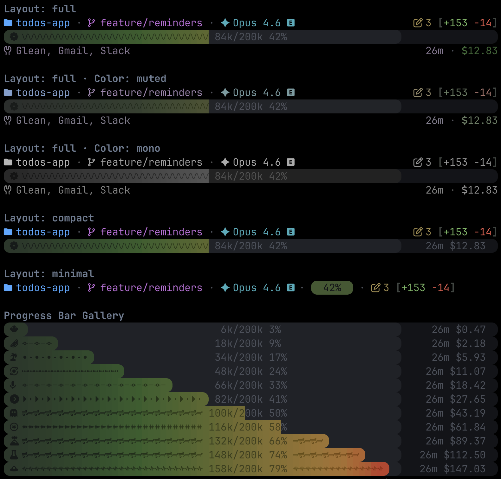

<p align="center">
  
</p>

<p align="center">
  <a href="LICENSE"></a>
  
  
  
</p>

<p align="center">
  <strong>A pure-bash statusline and audio chime pack for Claude Code — randomized flair, context-aware colors, zero background processes.</strong>
</p>




## Quick Start

```
/plugin marketplace add jcraigk/nerdflair
/plugin install nerdflair@jcraigk-nerdflair
/nerdflair setup
```

Restart Claude Code after setup for the statusline to appear.


## Features

- **3 layout modes** — full (3 rows), compact (2 rows), minimal (1 row with context pill)
- **Colorful context bar** (green -> amber -> red) with compaction threshold marker
- **Randomized icons and fill textures** (flair)
- **3 color palettes** — vibrant (full color), muted (desaturated), mono (grayscale)
- **Terminal bell** (tab indicator) on Stop, Notification, and PermissionRequest events
- **Audio chimes** with 20+ styles, configurable per-event, with adjustable volume (macOS only)
- Git branch, files edited, and lines added/removed
- Model name with output style indicator
- Active MCP servers
- Session cost and API duration


## Prerequisites

**A Nerd Font is required.** The statusline uses Nerd Font glyphs for icons, Powerline caps, and context bar textures. Without one, characters render as boxes.

Install via Homebrew:

```bash
brew install --cask font-jetbrains-mono-nerd-font
```

<details>
<summary><strong>Terminal font configuration</strong></summary>

Installing only puts the font files on disk; your terminal won't use it until you select it:

| Terminal | Where to set the font |
|----------|----------------------|
| **iTerm2** | Settings -> Profiles -> Text -> Font -> select "JetBrainsMono Nerd Font" |
| **Terminal.app** | Settings -> Profiles -> (your profile) -> Font -> Change -> select "JetBrainsMono Nerd Font" |
| **Warp** | Settings -> Appearance -> Terminal font -> select "JetBrainsMono Nerd Font" |
| **Ghostty** | Add `font-family = JetBrainsMono Nerd Font` to `~/.config/ghostty/config` |
| **VS Code terminal** | Settings -> search "terminal font" -> set Terminal > Integrated: Font Family to `JetBrainsMono Nerd Font` |

</details>


## Usage

Use the `/nerdflair` command to configure the statusline:

<details>
<summary><strong>Command reference</strong></summary>

| Command | Effect |
|---------|--------|
| `/nerdflair` | Interactive menu (setup, cycle layout/color, toggle flair) |
| `/nerdflair info` | Show current settings without changing anything |
| `/nerdflair chime-events` | Show/toggle which events play chimes |
| `/nerdflair chime-style` | Cycle chime style (random, BalladPiano, ...) |
| `/nerdflair chime-volume [0-100]` | Set chime volume (0 = muted) |
| `/nerdflair color-palette` | Cycle palette: vibrant -> muted -> mono |
| `/nerdflair flair` | Toggle context bar decorations (icon + texture) |
| `/nerdflair layout [mode]` | Set or cycle layout (full, compact, minimal) |
| `/nerdflair setup` | First-time setup (font check, settings.json config) |
| `/nerdflair terminal-bell` | Toggle terminal bell on/off (tab indicator) |
| `/nerdflair width [auto\|50-150]` | Set layout width |

</details>


## How It Works

Three bash scripts, one JSON state file, zero background processes.

- **`scripts/statusline-command.sh`** — The renderer. Claude Code pipes JSON session data to this on every statusline refresh. It reads layout state from `~/.claude/statusline-state.json` and renders the appropriate rows.
- **`scripts/nerdflair.sh`** — The configurator. Toggles modes, flair, colors, etc. by writing to the same state file.
- **`hooks/bell.sh`** — The notification handler. Fired by hooks on 5 events (Stop, Notification, PermissionRequest, SessionStart, SessionEnd). Sends terminal bell (BEL character) on all platforms and plays audio chimes via `afplay` on macOS.

Pure bash with a `jq` dependency for JSON parsing.
